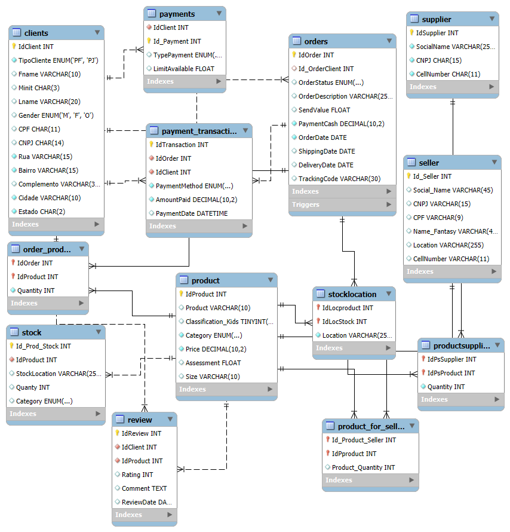

# 📦 Projeto Banco de Dados E‑commerce

## 📖 Descrição
Este projeto implementa um **banco de dados relacional** para simular um sistema de **e‑commerce**.  
O objetivo é gerenciar **clientes, produtos, pedidos, estoque e transações de pagamento**, além de permitir **consultas analíticas** que auxiliam na tomada de decisão.

> ⚠️ Todos os dados são fictícios.  
> 🎯 O foco está em **boas práticas de modelagem** e **consultas SQL**, de forma clara e didática.

---

## 🏗️ Modelagem

O banco foi estruturado com as seguintes entidades principais:

- **Clients** → Cadastro de clientes (PF ou PJ, mutuamente exclusivos)  
- **Product** → Catálogo de produtos (eletrônicos, roupas, brinquedos, alimentos)  
- **Orders** → Pedidos realizados pelos clientes  
- **Order_Product** → Relação N:N entre pedidos e produtos  
- **Stock** → Controle de estoque por produto e local  
- **Payment_Transaction** → Registro de pagamentos e métodos utilizados  
- **Reviews** → Avaliações de clientes sobre os produtos  
- **Payment_Method** (extensão sugerida) → Tabela dedicada aos métodos de pagamento  

---

## 🗂️ Diagrama Entidade-Relacionamento (ER)



---

## 📖 Explicação do Modelo ER

- **Clients → Orders**: um cliente pode realizar vários pedidos, mas cada pedido pertence a apenas um cliente.  
- **Orders → Order_Product → Product**: a relação entre pedidos e produtos é N:N, resolvida pela tabela intermediária.  
- **Product → Stock**: cada produto possui um controle de estoque, que pode variar por localidade.  
- **Orders → Payment_Transaction → Payment_Method**: cada pedido gera transações financeiras associadas a um método de pagamento (Pix, cartão, Bitcoin).  
- **Clients → Reviews → Product**: clientes podem avaliar produtos, registrando nota e comentário.  

Esse modelo garante **normalização**, evita **redundâncias** e permite consultas analíticas sobre clientes, vendas, logística, estoque e comportamento de consumo.

---

## 🔮 Possíveis Extensões

- **Tabela de vendedores**: associar pedidos a vendedores.  
- **Histórico de estoque**: registrar movimentações (entrada/saída).    
- **Avaliações de clientes (reviews)**: expandir com médias por produto.  
- **Status detalhado de entrega**: rastrear etapas logísticas.    
- **Métodos de pagamento**: unificação com suporte a diferentes moedas e precisões (ex.: BTC com 8 casas decimais).  

---

## 🚀 Como Executar

1. Criar o banco de dados:
   ```sql
   CREATE DATABASE ecommerce;
   USE ecommerce;
   
2. Executar os scripts de criação das tabelas.
3. Popular com os INSERTs fornecidos.
4. Rodar as queries analíticas para gerar insights.

📈 Exemplos de Consultas Analíticas

### 1. Quantos pedidos foram entregues?

```sql
SELECT 
  OrderStatus,
  COUNT(*) AS TotalPedidos
FROM Orders
WHERE OrderStatus = 'Delivered'
GROUP BY OrderStatus; 
```

###  2. Pedidos cancelados por cliente.

```sql
SELECT
  c.IdClient AS Id_OrderClient,
  c.CNPJ AS empresa,
  CONCAT(c.Fname, ' ', c.Lname) AS Cliente,
  o.OrderStatus,
  COUNT(*) AS TotalPorStatus
FROM orders o
JOIN clients c ON o.Id_OrderClient = c.IdClient
WHERE o.OrderStatus = 'cancel'
GROUP BY c.IdClient, c.CNPJ, CONCAT(c.Fname, ' ', c.Lname), o.OrderStatus
ORDER BY TotalPorStatus DESC;
 ```

## 3. Tempo médio de entrega

```sql
SELECT 
  AVG(DATEDIFF(DeliveryDate, OrderDate)) AS MediaDiasEntrega
FROM orders
WHERE DeliveryDate IS NOT NULL; 
```


📝 Autor
Projeto desenvolvido por Victor Biscaia, como estudo de modelagem e análise de dados em SQL para e‑commerce.
- 👤 Autor: Victor Biscaia
- 🎓 Uso: Projeto acadêmico para portfólio e prática de SQL/modelagem
- 📜 Licença: Livre uso educativo; adapte conforme necessidade do seu repositório


